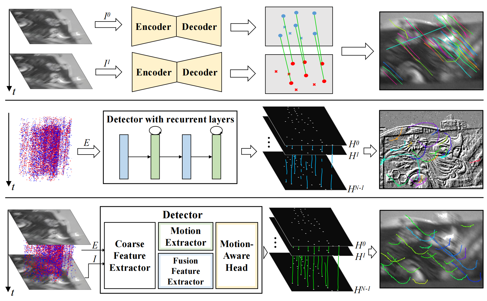
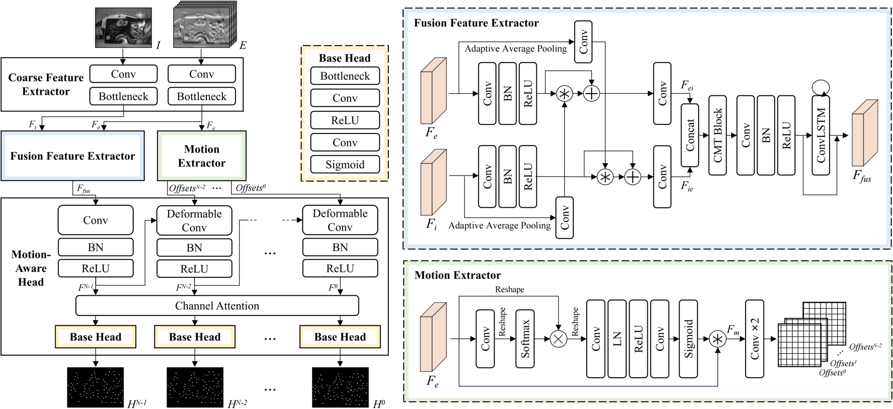

# [FE-DeTr: Keypoint Detection and Tracking in Low-quality Image Frames with Events](https://github.com/yuyangpoi/FE-DeTr)

*Authors:* Xiangyuanw Wang, Kuangyi Chen, [Wen Yang](http://www.captain-whu.com/yangwen_En.html), [Lei Yu](https://scholar.google.com/citations?hl=zh-CN&user=Klc_GHUAAAAJ), Yannan Xing, [Huai Yu](https://scholar.google.com/citations?user=lG7h27kAAAAJ&hl=zh-CN)

# Update
Extreme Corners Dataset and Better detectors and trackers that support high temporal resolution! 
[https://github.com/yuyangpoi/FF-KDT]

# Introduction
FE-DeTr includes a novel keypoint detection network that fuses the textural and structural information from image frames with the high-temporal-resolution motion information from event streams. The network leverages a temporal response consistency for supervision, ensuring stable and efficient keypoint detection. Moreover, we use a spatio-temporal nearest-neighbor search strategy for robust keypoint tracking. 

<video width="1280" height="720" controls>
  <source src="https://github.com/yuyangpoi/FE-DeTr/blob/main/figures/FE-DeTr_20230922_21330589.mp4" type="video/mp4">
</video>

# Network Architecture

